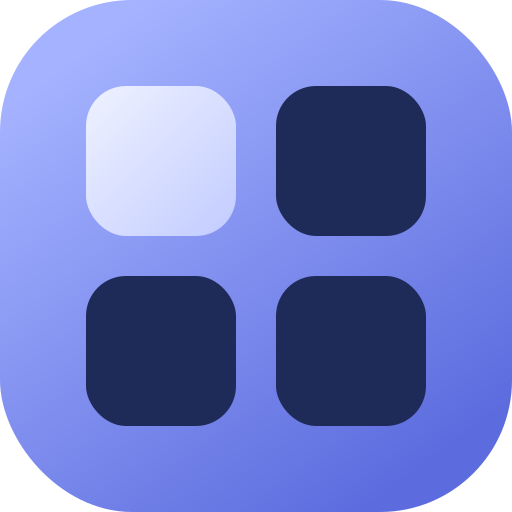

The design system for GRID course content: one set of Console tokens and
components flowing from wiki markdown to a styled web page, a Canvas LMS
fragment, and print. **This page is built by the pipeline it documents** —
everything you're looking at is the system rendering its own markdown.

::: callout-note
Specs, decisions, and source live in
[the repository](https://github.com/rvcc-grid-program/grid-design-system) —
start with `HANDOFF.md` for the authoring contract and `CANVAS-NOTES.md`
for the Canvas sanitizer findings.
:::

## See it

::: link-row
[The specimen — every component, live](specimen.html)
:::

The specimen exercises every component in the system. It follows your OS
light/dark setting — or use the sun/moon toggle in the header (your choice
sticks). Narrow the window to phone width, and print-preview it to see the
print styles.

- [The Canvas fragment](specimen.canvas.html) — the same specimen as Canvas
  receives it: every style inlined, classes renamed to `data-class`,
  uppercase baked into text. View source to see what the sanitizer gets.

## How it reads

A few of the components, doing their jobs:

::: objectives

When you have completed this page you will be able to:

- Recognize the Console theme shared with the GRID claim app
- Know where the specimen and the Canvas fragment live
- Find the spec documents in the repository

:::

::: callout-warning
Canvas strips `box-shadow`, `letter-spacing`, `opacity`, negative margins,
and `text-transform`. Every component here is designed to survive that —
borders carry structure, shadows are garnish, and uppercase is baked in at
build time.
:::

::: checkpoint
If this page looks consistent with the claim app students use on day one,
the system is doing its job — one brand from first login to final project.
:::

## Brand assets

The GRID mark in every format — the top-left cell lit: your spot in the
grid. The set is versioned in the repository and served from this site, so
any GRID property can reference
`https://rvcc-grid-program.github.io/grid-design-system/icons/<file>`.
Click a tile for the full-size asset.

  <a class="icon-tile" href="icons/grid-icon.svg">grid-icon.svg</a>
  <a class="icon-tile" href="icons/favicon.svg">favicon.svg</a>
  <a class="icon-tile" href="icons/apple-touch-icon.svg">apple-touch-icon.svg</a>
  <a class="icon-tile" href="icons/maskable.svg">maskable.svg</a>
  <a class="icon-tile" href="icons/icon-512.png">icon-512.png</a>
  <a class="icon-tile on-light" href="icons/grid-glyph-mono.svg">grid-glyph-mono.svg</a>

Rasters for favicons (16/32/48), the 180px apple-touch PNG, PWA sizes
(192/512 + maskable), and the claim app's `site.webmanifest` are in
[the icons folder](https://github.com/rvcc-grid-program/grid-design-system/tree/main/docs/icons)
alongside these. The monochrome glyph is `currentColor` — it inherits
whatever color the surrounding text has when inlined; the tile above shows
it on a light surface.

## For maintainers

The repository holds the full spec: `HANDOFF.md` for component DOM
contracts and the authoring table, `CANVAS-NOTES.md` for the verified
Canvas sanitizer findings, `DECISIONS.md` for why everything is the way it
is, and `CONTRAST.md` for the generated accessibility verification. Build
this site with `pnpm run site`.

Course wikis consume the system as a pinned package —
`pnpm add "github:rvcc-grid-program/grid-design-system#v1.4.0"` — and get
the `grid-preview` / `grid-canvas` CLIs plus a `grid.config.json` for their
course branding. The first consumer is the IDMX-225 wiki.
